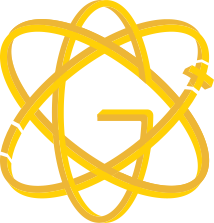

<!-- Don't delete it -->

<!-- Organization Logo -->

  
  &nbsp;
  &nbsp;
  
  &nbsp;
  &nbsp;
  

&nbsp;

<!-- Organization Name -->

<!-- Organization/Project Social Handles -->

<!-- Telegram -->

&nbsp;&nbsp;
<!-- X (formerly Twitter) -->

&nbsp;&nbsp;
<!-- Discord -->

&nbsp;&nbsp;
<!-- Medium -->

&nbsp;&nbsp;
<!-- LinkedIn -->

&nbsp;&nbsp;
<!-- Youtube -->

<!-- Project core values and objective -->
<blockquote align="center">
  
&nbsp;

  <strong>
  <em>Gluon is a cryptocurrency stabilization protocol inspired by nuclear physics. It splits existing tokens into stable and unstable components, called "tokeons" (from "token" and "nucleon"), instead of issuing new tokens, <a href="https://www.youtube.com/watch?v=tnvm1we6xts">Know More By Dr. Bruno W. Paleo</a>.</em>
  </strong>
  
&nbsp;

</blockquote>

---

<!-- Table of Contents -->

  
Table of Contents

  <ul>
    <li><a href="#gluon-solidity-webui"> ➤ Gluon Solidity WebUI</a></li>
    <!-- Don't delete it -->
    <li><a href="#fund"> ➤ Fund Stability Nexus</a></li>
  </ul>

<!-- Project Description (Start from here) -->

# Gluon Solidity WebUI

<!-- Use Back Button after each section -->

<kbd><a href="#readme-top">↑ Back to top ↑</a></kbd>

---

<!-- Don't delete it -->
<!-- Funding Badge -->

